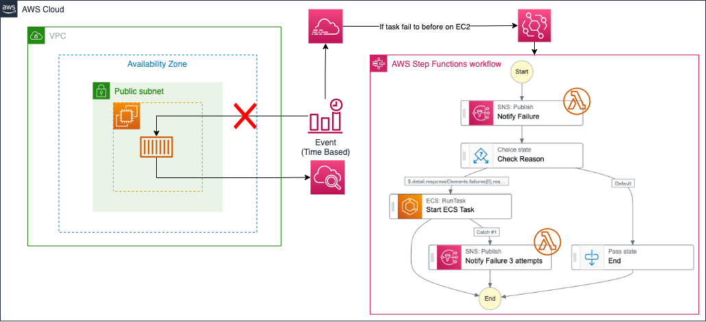

# ecs_rerun_cfn
This repository contains a CloudFormation stack to rerun ECS tasks on EC2 instances if they fail before reaching the EC2 instance. This typically occurs when the ECS Agent running on the EC2 instance is disconnected. You can refer to [API failure reasons](https://docs.aws.amazon.com/en_us/AmazonECS/latest/developerguide/api_failures_messages.html) for a comprehensive list of reasons why the ECS API may fail, particularly the `RunTask` or `StartTask` actions.

## How it works

The stack creates the following resources:

1. EventBridge (and rules)
2. Step Functions
3. SNS Topic
4. Lambda Function

And some IAM roles and policies.

When an ECS API failure occurs, EventBridge catches the error and triggers the Step Functions. The Step Functions then notify the SNS Topic of the error, which triggers a Lambda Function to send a message to Slack. If the reason for the failure is AGENT, the task is retried up to three times.

## How to use

To create the stack, use the [quick-create links](https://console.aws.amazon.com/cloudformation/home?region=ap-northeast-1#/stacks/create/review
?templateURL=https://s3.ap-northeast-1.amazonaws.com/cd-template-okamos/ecs_rerun_cfn/main.yml).
If you don't require Slack notifications, you can use this  alternative [quick-create links](https://console.aws.amazon.com/cloudformation/home?region=ap-northeast-1#/stacks/create/review
?templateURL=https://s3.ap-northeast-1.amazonaws.com/cd-template-okamos/ecs_rerun_cfn/no-slack.yml) to create the stack.

## Debugging

If you wish to reproduce this scenario for testing purposes, you can use the `terraform` directory and apply it to create the environment shown in the left thumbnail.

Then, modify the outbound rules of the subnet where the EC2 instance exists to block traffic to the ECS API endpoint. For more information, refer to [How to manually trigger an AGENT error when running ECS RunTask](https://dev.classmethod.jp/articles/how-to-manually-raise-an-agent-error-when-execute-ecs-run-task/).

## License

[MIT](https://choosealicense.com/licenses/mit/)
